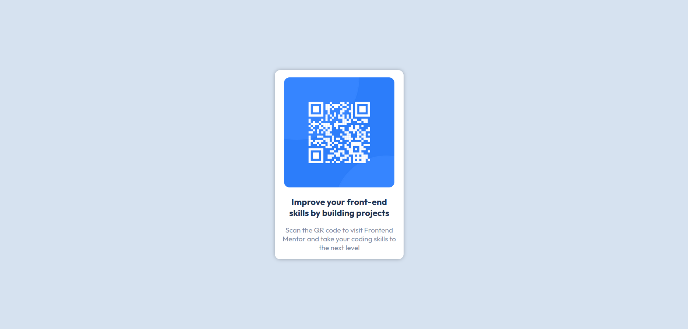

# Frontend Mentor - QR code component solution

This is a solution to the [QR code component challenge on Frontend Mentor](https://www.frontendmentor.io/challenges/qr-code-component-iux_sIO_H). Frontend Mentor challenges help you improve your coding skills by building realistic projects. 

## Table of contents

- [Overview](#overview)
  - [Screenshot](#screenshot)
- [My process](#my-process)
  - [Built with](#built-with)
  - [What I learned](#what-i-learned)
  - [Useful resources](#useful-resources)
- [Author](#author)

## Overview

### Screenshot

## My process

### Built with

- Semantic HTML5 markup
- CSS custom properties
- Flexbox

### What I learned

Through this i learned about how you can center a element in the page using flex box and someother css properties and how to use them properly.

### Useful resources

- [Centering a div](https://www.freecodecamp.org/news/how-to-center-a-div-with-css/) - Read this to learn about how to center a div.

## Author

- Frontend Mentor - [@TheXro](https://www.frontendmentor.io/profile/TheXro)
- Twitter - [@_ravi_y](https://www.twitter.com/yourusername)
